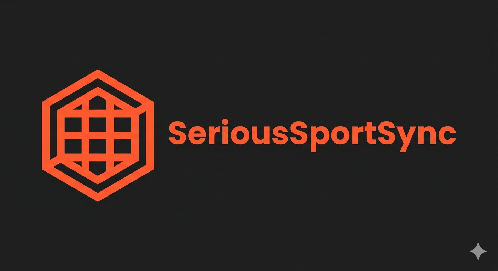

<p align="center">
  
</p>

# 📅 SeriousSportSync — Sports Metadata & Calendar Add-on

> A self-hosted add-on that turns combat sports, pro-wrestling, motorsport and more into proper meta items — with a built-in calendar of upcoming events and optional resolve-on-play of cached links via your own indexers and debrid accounts.
>
> 🎯 **Primarily designed for [Nuvio](https://github.com/zaarrak/Nuvio)** (a Stremio-compatible client tuned for sports/live content). Also works with **Stremio** and other compatible clients.

[](#)
[](./LICENSE)
[](#)
[](https://www.stremio.com/)

---

## ⚠️ Disclaimer

> This project provides **event metadata** and **resolves links from third-party services that the operator chooses to configure**. It is published strictly for **educational and personal-use** purposes.
>
> SeriousSportSync **hosts no content**, ships **no indexers or keys**, and has **no affiliation** with any sport, league, broadcaster, indexer, debrid provider, or other organisation. The user/operator brings their own sources and accounts and is solely responsible for ensuring their use complies with the terms of those services and the laws of their jurisdiction.

---

## ✨ What it does

SeriousSportSync is, first and foremost, a **sports metadata add-on and event calendar** for Nuvio / Stremio:

- 📅 **Calendar of upcoming events** for every supported sport — see what's airing this week or next month, with posters, dates, and event descriptions, all browsable in Discover.
- 🏷️ **Proper meta items** for sports events that mainstream meta providers (IMDb / TMDb) don't index — so they actually appear as first-class entries instead of being unfindable.
- 🔎 **Smart per-event search aliases** built into each promotion so name-matching indexers find the right scene release for the right event (number, date, fighter / driver / wrestler matchup).
- 🎯 **Optional resolve-on-play streaming** — if you've configured your own indexers and debrid accounts, the add-on advertises stream rows without touching any debrid; the resolve happens only when you press play. A search can never pollute your debrid account, and a single provider outage can't stall results from the others.
- 🛡️ **Provider-side filter awareness** — automatic keyword pre-filter and a self-learning denylist for hashes that fail provider-side content checks, so dead rows are pruned over time.

---

## 🏆 Covered sports

| Sport | Events | Calendar |
|-------|--------|----------|
| 🥋 **UFC** | PPVs, Fight Nights, UFC on ABC/ESPN | Recent + Upcoming |
| 🥊 **ONE Championship** | Numbered events, Fight Night, Friday Fights | Recent + Upcoming |
| 🎤 **WWE** | PLEs, named NXT events, Saturday Night's Main Event | Recent + Upcoming |
| 🤼 **AEW** | PPVs + Zero Hour pre-shows | Recent + Upcoming |
| 🏎️ **Formula 1** | Per-session items per Grand Prix weekend (Practice / Qualifying / Sprint / Sprint Qualifying / Race) | Per-session rows + Upcoming Races |
| 🥊 **Boxing** | PPV cards from all major promoters (Top Rank, PBC, Matchroom, MVPW, etc.) | Recent + Upcoming |

Adding another sport or promotion is a single self-contained entry in `lib/promotions.js` — see [Adding a promotion](#-adding-a-promotion). Designed to be extended to any sport that has structured event data (football, basketball, boxing, MotoGP, you name it).

---

## 🔌 How it talks to your stack

```
                            ┌─────────────────────────────────┐ ──search──► Prowlarr
   Nuvio / Stremio          │         SeriousSportSync         │ ──search──► Zilean
   ──catalog / meta─────────►   metadata · calendar · cache ·  │ ──search──► HTML direct indexer (optional drop-in)
            ◄────rows────   │   web UI · /resolve endpoint     │
                             └─────────────────────────────────┘
                                          │  click play → add + unrestrict
                                          ▼
                           Compatible debrid providers (your own keys)
```

**Bring your own sources, bring your own accounts.** Point it at any combination of Prowlarr, Zilean, and/or a drop-in HTML-indexer module. Plug in keys for any supported debrid provider on a per-user basis. The metadata + calendar work with zero indexers configured; the optional streaming side needs at least one source **and** at least one provider key.

---

## 🚀 Quick start (Docker)

```bash
git clone https://github.com/<your-user>/serioussportsync.git
cd serioussportsync
cp .env.example .env
# Minimum: set SESSION_SECRET (openssl rand -hex 32) and ADMIN_USER.
docker compose up -d --build
```

The container listens on `:7000`. First-run setup:

1. 🔑 Open `http://<your-server>:7000/` — you'll get a **login / first-run signup** page. Create an account; if its username matches `ADMIN_USER`, it's auto-promoted to admin.
2. 🛠️ *(Optional, for streaming)* Go to **Admin → Indexer sources** and enter your indexer URL(s) + key(s). You can also set these via env; the GUI overrides env and applies live without a restart.
3. 🧩 *(Optional)* Drop a custom HTML-scraping module at `lib/sources/extra.js` (or `lib/sources/local.js`) exporting `multiSearch(queries, opts)` — loaded automatically alongside the built-in sources. Gitignored, never committed.
4. 🔐 *(Optional, for streaming)* On your **account page**, paste your debrid provider key(s). Each user manages their own.
5. ✅ Copy your personal **install URL** from the account page and add it in **Nuvio** (or Stremio): **Add-ons → paste the URL → Install**.

Even with zero indexers and zero debrid keys configured, the calendar and metadata catalogs work fully — you'll just see meta rows without stream options.

---

## ⚙️ Configuration

Everything is env-driven with sensible defaults (see [`.env.example`](./.env.example) for the full annotated list). Indexer endpoints can also be set in the admin GUI, which overrides env.

| Variable | Default | Purpose |
|----------|---------|---------|
| `SESSION_SECRET` | _(required, ≥32 chars)_ | Signs login cookies — generate with `openssl rand -hex 32`. The server refuses to boot if unset or too short. Dev escape hatch: `ALLOW_INSECURE_SECRET=1`. |
| `ADMIN_USER` | — | Username auto-promoted to admin on first signup |
| `LOGIN_MAX_FAILS` / `LOGIN_WINDOW_MS` / `LOGIN_LOCKOUT_MS` | `5` / `900000` / `900000` | Per-IP login rate-limit: lock out after N failed sign-ins within window-ms, for lockout-ms |
| `PUBLIC_URL` | _(auto)_ | Public origin for install URLs (honours `X-Forwarded-*`) |
| `ADDON_TYPE` | `movie` | Client item type (`tv`/`series` for some clients) |
| `PROWLARR_URL` / `PROWLARR_API_KEY` | — | Prowlarr indexer source (or set in GUI) |
| `ZILEAN_URL` | — | Zilean DMM-hashlist source (or set in GUI) |
| `TSDB_API_KEY` | `3` | TheSportsDB key (`3` = free; Patreon key = higher limits) |
| `EVENT_WINDOW_DAYS_BACK` / `_AHEAD` | `30` / `90` | Calendar / metadata sliding window |
| `REFRESH_INTERVAL_HOURS` | `6` | Metadata refresh cadence (0 = off) |
| `STREAM_CACHE_TTL_HOURS` | `6` | Candidate-cache freshness |
| `STREAM_CACHE_REFRESH` / `_HOURS` | `on` / `3` | Proactive candidate warmer |
| `RD_BLOCKED_KEYWORDS` | `AMZN,NF,CR,YTS,RARBG,WEBRip` | Skip rows whose title contains a tag a provider is known to keyword-filter — see [Provider keyword filtering](#-provider-keyword-filtering) |
| `RD_DENYLIST_TTL_DAYS` | `30` | How long a 451-flagged hash (hard) stays out of advertised rows |
| `RD_SOFT_DENYLIST_HOURS` | `24` | How long a non-451 "not cached / unresolvable" RD hash stays out of advertised rows (may come back if it later gets cached) |
| `HTTPS_PROXY` / `HTTP_PROXY` / `NO_PROXY` | — | Route public indexer traffic via a VPN (keep internal services in `NO_PROXY`) |

🔐 Debrid provider keys are **never** env vars — they're per-user, entered on each user's own account page. Admins can rotate tokens but cannot see install URLs or provider keys.

---

## 🛡️ Provider keyword filtering

Some debrid providers have started returning content-unavailable errors for cached files whose filename contains certain release-tag keywords. It's filename-keyword filtering at the provider's end (not per-hash takedown) and affects every add-on in the ecosystem that fronts those providers.

SeriousSportSync defends in **two layers**, without sending probe requests during a search:

1. 🚦 **Pre-filter at row-build** — `RD_BLOCKED_KEYWORDS` (a comma list, env-tunable, no restart needed) skips affected provider rows for any candidate whose title matches. Free, no provider calls. The default list omits common sports-rip tags (e.g. `WEB-DL`) so legitimate releases aren't pruned upfront; the denylist below backstops anything that does slip through.
2. 🧠 **Persistent denylist** — when a provider blocks a hash at resolve time, the hash is recorded to `data/rd-denylist.json` (30-day TTL by default). Future stream rows skip that provider for that hash for everyone on the instance. Self-healing.

Other providers that don't apply the same filter continue to show rows for the same candidates.

---

## 🏗️ Architecture

```
.
├── server.js                 HTTP entry point + scheduled refresh & warmer
├── addon.js                  Express routes (manifest / catalog / meta / stream / resolve + login / account / admin GUI)
├── config.js                 env-driven config (defaults)
├── lib/
│   ├── promotions.js         📂 PROMOTION REGISTRY — add new sports / leagues here
│   ├── manifest.js           add-on manifest (catalogs + version derive automatically)
│   ├── catalog.js            catalog handler (per-promotion filter / sort)
│   ├── meta.js               meta detail handler
│   ├── transform.js          normalize raw events → meta shape
│   ├── streams.js            source search → relevance filter → optimistic row build → /resolve URL
│   ├── streamcache.js        persistent candidate cache (data/stream-cache.json)
│   ├── rd-denylist.js        persistent provider-filter denylist (data/rd-denylist.json)
│   ├── settings.js           GUI-set runtime settings (indexer endpoints)
│   ├── users.js              multi-user accounts, invites, per-user config
│   ├── sessions.js           signed session cookies
│   ├── store.js              metadata JSON store (data/events.json)
│   └── sources/
│       ├── thesportsdb.js    metadata client
│       ├── onefc.js          watch.onefc.com metadata client
│       ├── wikipedia.js      enrichment (descriptions / posters)
│       ├── prowlarr.js       Prowlarr search + hash hydration
│       ├── zilean.js         Zilean DMM-hashlist search
│       ├── extra.js          (optional, gitignored) drop-in HTML indexer client
│       └── *.js              one client file per supported debrid provider (gitignored keys, never bundled)
├── scripts/
│   ├── refresh.js            pull events from each promotion's source
│   └── refresh-streams.js    proactive candidate-cache warmer
├── public/                   branded fallback artwork
└── docker-compose.yml
```

**Resolve-on-play flow:** `/stream` advertises one row per supported provider per top candidate. Each row's URL points at `/u/<userId>/<token>/resolve/<provider>/<eventId>/<infoHash>`. The client's "play" click hits that endpoint; the addon then calls that provider's resolve path and 302-redirects to the playable URL. A provider is touched only on a real play — never on a search.

**Background timing at a glance:**

- ⏱️ Metadata refresh: **every 6 h** (`REFRESH_INTERVAL_HOURS`)
- 📦 Candidate-cache TTL: **6 h** (empty entries **30 min**)
- 🔥 Candidate warmer: **every 3 h**, window –90 days to +1 day
- 🚫 Provider-filter denylist TTL: **30 days**

---

## 🧩 Adding a promotion

Append an entry to `all` in `lib/promotions.js`. Each promotion is fully self-contained:

```js
{
  id: 'bellator',
  name: 'Bellator MMA',
  idPrefix: 'bellator',
  enabled: true,
  source: { type: 'thesportsdb', leagueId: 'XXXX' },
  posterShape: 'landscape',
  classify(name)    { /* → kind */ },
  buildAliases(name){ /* search aliases */ },
  isRelevantStreamTitle(title, event) { /* gate candidates */ },
  catalogs: [
    { id: 'bellator-recent',   name: 'Bellator Recent',   filter, sort },
    { id: 'bellator-upcoming', name: 'Bellator Upcoming', filter, sort },
  ],
  includeEvent(ev)  { return true; },
  genres(ev)        { return ['Sports', 'MMA', 'Bellator']; },
}
```

`manifest.js`, `catalog.js`, `streams.js`, and the refresh scripts all consume the registry — no other file needs editing. Restart and the new catalogs appear in the client's Discover.

---

## 🔧 Manual operations

```bash
# Force a metadata refresh now
docker compose exec serioussportsync npm run refresh

# Warm the stream-candidate cache now (or use Admin → "Warm stream cache now")
docker compose exec serioussportsync npm run refresh-streams

# Health probe (machine-readable)
curl http://localhost:7000/health

# Debug a stream resolve (shows rejection reasons) — needs a user's token
curl "http://localhost:7000/u/<userId>/<token>/stream/movie/ufc:NNNNN.json?debug=1" | jq

# Inspect the provider-filter denylists / positive cache
cat data/rd-denylist.json data/tb-denylist.json data/pm-denylist.json data/positive-cache.json
```

Most of the above is available in the **admin dashboards** without dropping to SSH:

- 📊 **Admin → Health** (`/admin/health`) — denylist sizes per provider (RD/TB/PM) with wipe buttons, positive-cache stats, last warmer run + per-provider verification counts, candidate-cache stats, and the backup download button.
- ⬇️ **Admin → Backup** (`/admin/backup`) — streams a timestamped `tar.gz` of `data/` (events, users, denylists, positive cache, stream cache, warmer status) as a download. Run periodically; restore by extracting back into the named Docker volume.

---

## 🆘 Troubleshooting

- 🕓 **Catalog / calendar empty after install** — the first refresh runs in the background on boot if the cache is empty (~1–3 min). Watch `docker compose logs -f serioussportsync`.
- 🚫 **No streams** — confirm a source is set (Admin → Indexer sources) and a provider key is on your account. Use the `?debug=1` endpoint to see rejection counts.
- 🔄 **Version not updating in the client** — clients cache the manifest; remove and re-add the add-on to pick up a new version.
- ⏱️ **TheSportsDB 429s** — the refresh paces calls and retries; a Patreon key raises the limit.
- 🔴 **Lots of dead provider rows** — see [Provider keyword filtering](#-provider-keyword-filtering); the keyword pre-filter and persistent denylist together should cull them within a few search cycles. If your set of dead rows shares a tag that isn't already blocked, add it to `RD_BLOCKED_KEYWORDS`.
- 🐛 **Stale candidate cache** — `data/stream-cache.json` is the persistent indexer-result cache; deleting it forces a full re-search on the next request. The proactive warmer will rebuild it in the background.

---

## 🛡️ Responsible use

This add-on is provided as a tool for **personal, educational use** with content you are entitled to access. It hosts no media. It ships no indexers, no provider credentials, and no preconfigured sources. Every link returned originates from a service the operator has independently chosen to wire up.

- ✅ Use it as a metadata add-on and calendar for sports you follow, and to resolve content you are entitled to access via services you legitimately subscribe to.
- ❌ Don't use it to facilitate copyright infringement.

You are solely responsible for ensuring your configuration and use comply with the terms of every third-party service involved and the laws of your jurisdiction. Contributors and the project itself accept no liability for misuse.

---

## 🙏 Acknowledgements

Built on the shoulders of the open ecosystem:

- [Nuvio](https://github.com/zaarrak/Nuvio) — the sports-focused Stremio-compatible client this add-on is primarily tuned for
- [TheSportsDB](https://www.thesportsdb.com/) — event metadata
- [Prowlarr](https://github.com/Prowlarr/Prowlarr) — indexer aggregation
- [Zilean](https://github.com/iPromKnight/zilean) — DMM hashlist index
- [Stremio Add-on SDK](https://github.com/Stremio/stremio-addon-sdk) — add-on protocol reference
- Inspiration from [MediaFusion](https://github.com/mhdzumair/MediaFusion), [AIOStreams](https://github.com/Viren070/AIOStreams), Torrentio, and Comet — pioneers of self-hosted, multi-provider Stremio tooling.

---

## 📄 License

MIT — see [LICENSE](./LICENSE). The MIT licence is permissive but is **not** a defence against operating the software in a way that violates the terms of the services you connect, or the laws of your jurisdiction. See [Responsible use](#%EF%B8%8F-responsible-use).
